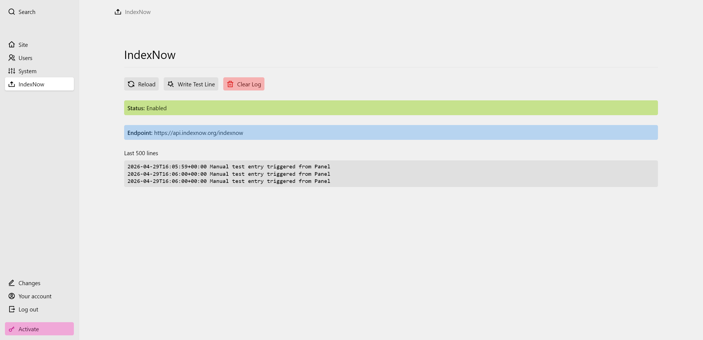

# IndexNow for Kirby

A Kirby 5 plugin that automatically submits published page URLs to [IndexNow](https://www.bing.com/indexnow/getstarted) when content changes, with a Panel log view.



## Why use IndexNow

IndexNow lets you instantly notify search engines when your content changes — instead of waiting for bots to discover it on their own. One submission reaches all participating engines (Bing, Yandex, Seznam, Naver, and others), which also share URLs with each other automatically. Since AI tools like ChatGPT, Copilot, and Perplexity rely on search engine indexes for their web knowledge, faster indexing means your content is more likely to be included and surfaced in AI-generated responses as well.

Key benefits:

- **Instant indexing** — changes appear in search results almost immediately, rather than days or weeks later
- **Efficient crawling** — search bots no longer need to poll your pages continuously, reducing unnecessary server load
- **Faster backlink recognition** — new links are discovered sooner, so link equity flows more quickly
- **Single submission** — notifying one participating engine alerts all the others automatically

## Features

- Submits on page create, update, publish, changeSlug, changeUrl, and changeTitle events
- Skips drafts and file assets — published pages only
- Batches submissions within a single request to avoid duplicate POSTs
- Logs to `site/logs/indexnow.log`
- Panel sidebar view: status, endpoint, last 500 log lines, reload/clear/test actions
- Debug-only test route to verify submissions without making a content change

## Installation

### Composer

```bash
composer require mynameisfreedom/kirby-indexnow
```

### Manual

Copy this plugin folder into `site/plugins/kirby-indexnow`.

## Getting a key

Generate a key at <https://www.bing.com/indexnow/getstarted#implementation>. Save it as a plain text file at your web root, e.g. `YOUR_KEY.txt`, containing only the key string. The file must be publicly accessible at:

```
https://your-domain.tld/YOUR_KEY.txt
```

## Configuration

Add to your `site/config/config.php` (or an environment-specific config file):

```php
return [
  'indexnow.enabled'  => true,
  'indexnow.key'      => 'YOUR_KEY',
  'indexnow.keyFile'  => 'YOUR_KEY.txt',
  // 'indexnow.endpoint' => 'https://api.indexnow.org/indexnow', // optional
];
```

All options:

| Option | Type | Default | Description |
|---|---|---|---|
| `indexnow.enabled` | bool | `!debug` | Enable automatic submissions |
| `indexnow.endpoint` | string | `https://api.indexnow.org/indexnow` | IndexNow endpoint (see note below) |
| `indexnow.key` | string | — | Your IndexNow key |
| `indexnow.keyFile` | string | — | Key filename at web root |
| `indexnow.log` | bool | `false` | Force logging in production |
| `indexnow.hookDebug` | bool | `false` | Log hook traces without submitting |
| `indexnow.maxPerBatch` | int | `1000` | Max URLs per shutdown batch |

> **Endpoint note:** `api.indexnow.org/indexnow` is the protocol-neutral endpoint — one submission reaches all participating search engines (Bing, Yandex, Seznam, Naver, Yep, and others), as they automatically share URLs with each other. You can also submit directly to a specific engine, e.g. `https://www.bing.com/indexnow`, but the default covers all of them.

Tip: set `indexnow.enabled => false` in development to avoid submitting from non-production environments.

## Verify it works

**Via the debug test route** (requires `debug => true`):

```
/indexnow-test?url=https://your-domain.tld/some-page
```

Optional query overrides: `force=1`, `key=...`, `keyFile=...`, `endpoint=...`

Expected response: `IndexNow test sent for … (HTTP 200)`

**Via a real content change:** publish a page or update its slug/title and check `site/logs/indexnow.log` for a submission line.

## Panel log view

Open the Kirby Panel and click **IndexNow** in the sidebar. The view shows the current status, configured endpoint, and the last 500 log lines, with buttons to reload, write a test entry, or clear the log.

## Troubleshooting

- **No submissions:** check that `indexnow.enabled` is not `false` (it's enabled by default in production; set to `false` to disable), and the page is published (not a draft).
- **4xx from endpoint:** confirm the key file is accessible at `https://<host>/<keyFile>` and its content matches `indexnow.key` exactly.
- **No log entries:** enable `debug` or set `indexnow.log => true`. Also check write permissions on `site/logs/`.
- **More detail without extra submissions:** set `indexnow.hookDebug => true` temporarily to trace which hooks fire.

## Development

```bash
npm install
npm run build   # builds src/index.js -> index.js
npm run dev     # watch mode
```

## License

MIT.
